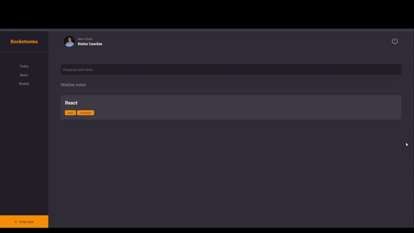

# Criando um site de Notas utilizando React.js
Este projeto é um modelo de layout desenvolvido com React.js para um site de anotações. Ele inclui várias páginas com funcionalidades distintas como login, criação de notas, perfil do usuário e visualização de todas as anotações.

## Funcionalidades
* Página de Login: Interface para autenticação de usuários.
* Página de Criação de Notas: Espaço para inserir novas anotações.
* Página de Perfil: Permite visualizar e editar o perfil do usuário.
* Página de Todas as Anotações: Exibe todas as anotações criadas pelo usuário.
## Tecnologias Utilizadas
* React.js: Biblioteca JavaScript para construção de interfaces de usuário.
* Styled-Components: Utilizado para escrever CSS em JS e aplicar estilos diretamente nos componentes.
* React Router Dom: O React Router DOM é uma biblioteca para gerenciamento de rotas em aplicações web criadas com React.

## 🔗 Links

## Demonstração 

